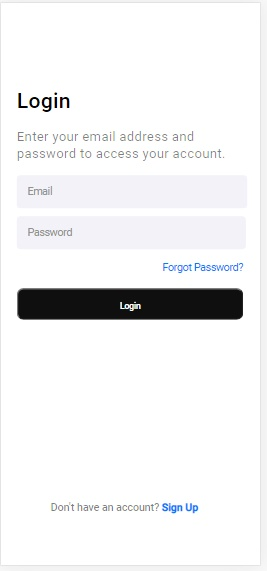

# Tela de Login App

Projeto layout tela de login de um aplicativo.

## 🔧 Funções Futuras

### Função 01:
- Usuário faz login no aplicativo.

### Função 02:
- Se esqueceu a senha poderá recuperar.

### Função 02:
- Se cadastrar no aplicativo.

## Download

Computer Version:

Smartphone Version:

## Veja o desenvolvimento do projeto:

Para ver o desenvolvimento acesse o planejamento:

## Feito Com:

